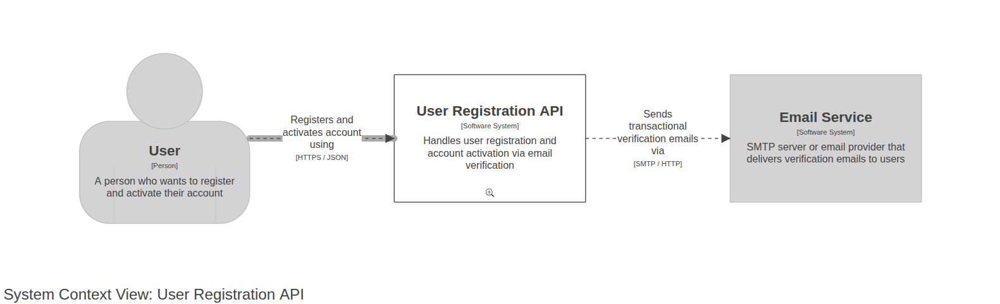
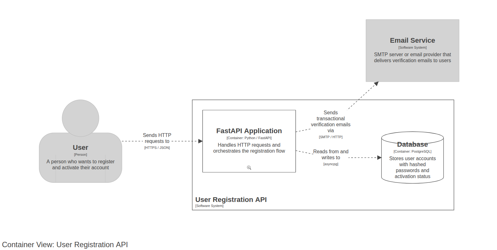
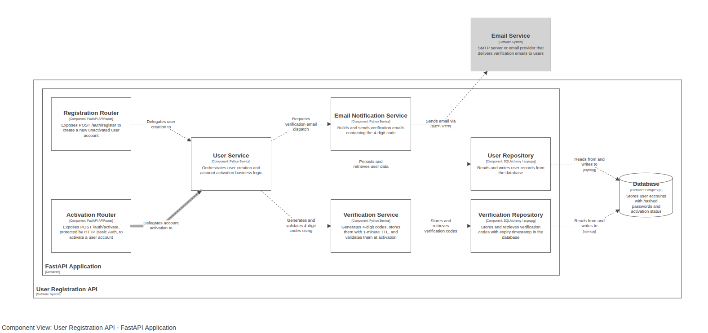
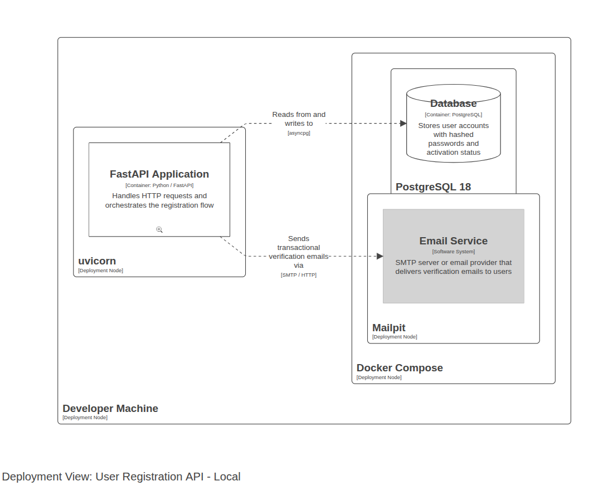

# Architecture

These diagrams follow the [C4 model](https://c4model.com/) and were generated with [Structurizr](https://structurizr.com/).

To explore the diagrams interactively, run the Structurizr local server:

```bash
docker run -it --rm -p 8080:8080 \
  -v $(pwd)/docs:/usr/local/structurizr \
  structurizr/structurizr local
```

Then open http://localhost:8080.

---

## Level 1 — System Context

Shows the User Registration API in relation to the people and external systems it interacts with.



| Element | Description |
|---|---|
| **User** | A person who registers an account and activates it via email |
| **User Registration API** | The system under design — handles registration and email verification |
| **Email Service** | External SMTP server or email provider (MailPit in local dev) that delivers the verification code |

---

## Level 2 — Container

Zooms into the User Registration API system and shows its internal containers.



| Container | Technology | Description |
|---|---|---|
| **FastAPI Application** | Python / FastAPI | Handles HTTP requests and orchestrates the registration flow |
| **Database** | PostgreSQL 18 | Stores user accounts (hashed passwords, activation status) and verification codes |

The FastAPI application communicates with the database over `asyncpg` and delegates email delivery to the external Email Service over SMTP.

---

## Level 3 — Component

Zooms into the FastAPI Application container and shows its internal components.



| Component | Description |
|---|---|
| **Registration Router** | Exposes `POST /api/v1/users` — creates a new inactive user account |
| **Activation Router** | Exposes `POST /api/v1/users/activate` (HTTP Basic Auth) — activates the account |
| **User Service** | Orchestrates user creation and account activation business logic |
| **Verification Service** | Generates 4-digit codes, stores them with a 60-second TTL, and validates them at activation |
| **Email Notification Service** | Builds and sends the verification email containing the 4-digit code |
| **User Repository** | Reads and writes user records using raw SQL via asyncpg |
| **Verification Repository** | Stores and retrieves verification codes with expiry timestamps |

---

## Deployment — Local

Shows how the system is run locally using Docker Compose.



| Node | Description |
|---|---|
| **uvicorn** | ASGI server hosting the FastAPI application |
| **PostgreSQL 18** | Database container initialised from `sql/init.sql` on first boot |
| **Mailpit** | Local SMTP mock — captures outbound emails and exposes them at http://localhost:8025 |

All three containers are orchestrated by Docker Compose. The API container waits for the database healthcheck before starting.
